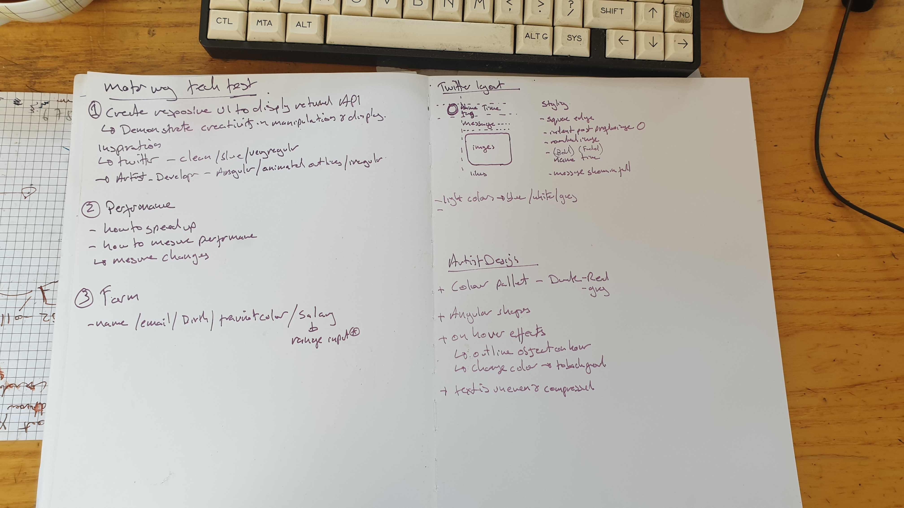

## Breakdown of time 

Browser used: Firefox (99.0.1)

Hello I hope your well, I have broken down how I spent the time on this tech test and how I apporached it.
I spent 20 mins looking at Twitter and Artist design website to get an idea of layout and styling as seen in my sketching.
I utilised the layout from Twitter and tried to bring in some of the styling from Artist design like colour pallet and I would like to add animated outline if I find time.
I spent around 2 hours on the building out the cards and arranging the layout and styling and about an 45 mins working on validating and building the form. Finaly I spent by about 30+ mins on Timing however this is an area for personal improment.
Below I have listed some of the thoughts I had during the procces and why I have done ceritan things.
- I was going to use grid or columns to make it 2 wide however Twitter is only a single column to I replicated that however it would be easy to change the layout to be 2 or more wide.
- I added the form as a Modal, I was unsure how it was desired to be displayed but this seemed like a clean way to implament the form.
- I have used Validation in many apps but for this prject and with the time I just checked that the user has used all inputs however I understad how to check with regex if that have used @ in emails and cuirtain caracters in the password.
- Mesuring time is something newer for me so I had to resarch this and implament somthing simple. This is an area I would be want to learn more about as it is very important to making the site run smoothly.
- Having come back from Typescript I had to check a few things as I went however these were not an issue just a reminder on syntax.

